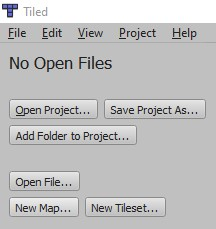
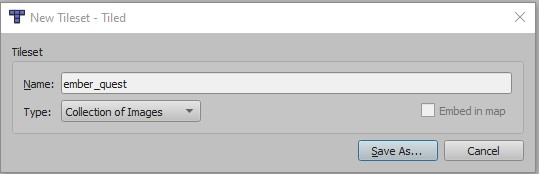
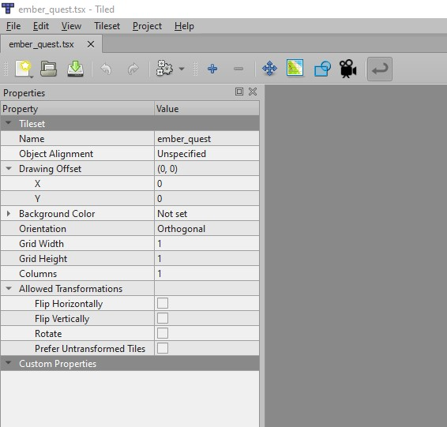
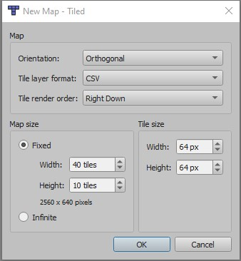

# 2. Introduction to Maps with Tiled

## Create a Tileset

The first thing we should do is create a tileset.  This can be accomplished by opening Tiled and
clicking `New Tileset...`.  

In the popup, give your new tileset a name such as `ember_quest` and
leave the `Type` as `Collection of Images` as we will be importing the existing Ember Quest sprites.

Create a new folder called `tiles` in the `assets` folder and save your tileset there.  Add the
`block`, `ember`, `ground`, `star`, and `water_enemy` sprites to the tileset by using the `+`
button.

Finally, save your file so it will be available to use with a level.  Do not close this file, as it
will be needed in the next section.

## Create a Level

To create the new level, click `File -> New -> New Map...`.  On the subsequent popup, choose the
following settings:

The main things to consider will be the size of the map and tiles.  These will be based on the
[original tutorial](../platformer/step_3.md) where we sketched out the world and defined the
parameters (using Tiled originally!!)  Based on the original plan, the tiles will need to be 64x64
and the map size will need a height of 10.  Originally, Ember Quest was an infinite side-scrolling
platformer game.  In this tutorial, we are converting Ember Quest to a traditional level-based
platformer, so we will need to decide on an appropriate width.  As such, 40 tiles wide is a good
initial size, but you can always increase the size of your level based on the complexity you want to
introduce to your world.  A final note, not every level has to have the same width or height, but
your tile size should always remain the same.

## Placing Objects

Now that we have a base map to work with, we need to populate it.  To do this, let us copy the final
results of the first 4 block sequence from Ember Quest.  First, click the ground sprite in the lower
right-hand corner.  After it is highlighted, click on the entire bottom row of tiles in the map, so
the ground blocks have been added.
